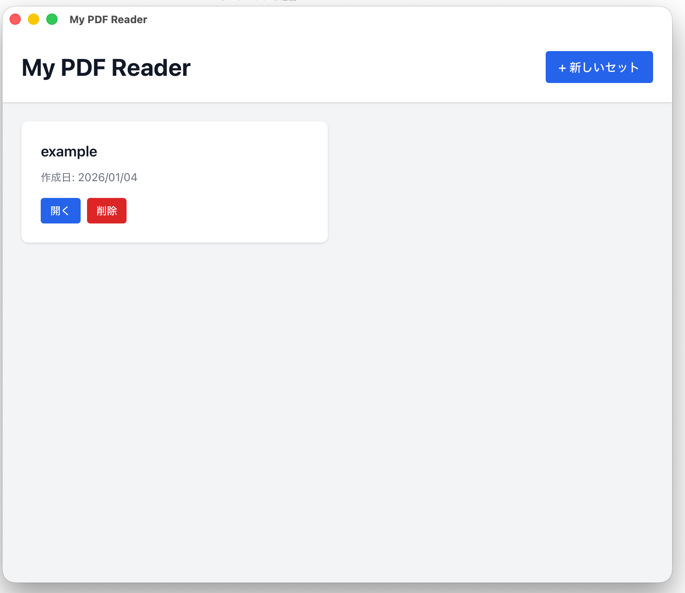
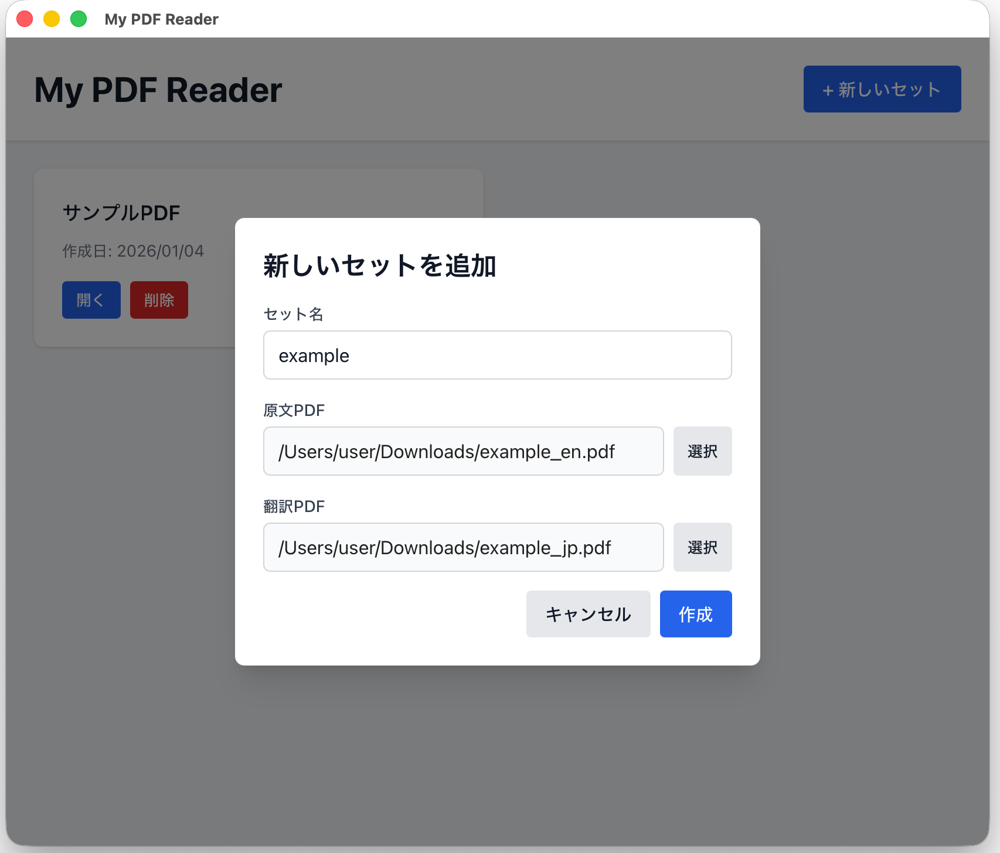

# My PDF Reader

このツールはPDFファイルを縦列で分割し、例えば左に原文右に翻訳されたPDFといった感じで比較しながら読みこむ便利ツールである。

英語の論文を読むのにいちいち画像翻訳して左右に並べてちょっとずつスクロールするのが面倒で作った自分専用ツール

## 使い方

1. 英語のPDFを入手
2. PDFを10ページずつ分割(オンラインで可能)
3. 分割したPDFをGoogle 翻訳でドラックアンドドロップで翻訳
4. 翻訳した10ページを結合する(これもオンラインで無料のサイトがある) 
5. このツールに原文と4で結合した翻訳完成版をドラックアンドドロップして比較しながら読める





## Requirement

- mise
- Rust (1.70以上推奨)
- Node.js (20以上推奨)

## 開発環境のセットアップ

1. **依存関係のインストール**
   ```bash
   npm install
   ```

2. **開発サーバーの起動**
   ```bash
   npm run tauri dev
   ```

   初回起動時はRustの依存関係のコンパイルに時間がかかります（約2分）。

3. **本番ビルド**
   ```bash
   npm run tauri build
   ```

   ビルドされたアプリケーションは以下に生成されます：
   - macOS: `src-tauri/target/release/bundle/`

## トラブルシューティング

### ビルドキャッシュのクリア

ビルドエラーが発生した場合、以下を実行してキャッシュをクリアしてください：

```bash
cd src-tauri && cargo clean
```

## プロジェクト構成

```
my-pdf-reader/
├── src/              # フロントエンド (Vite + TypeScript)
├── src-tauri/        # バックエンド (Rust + Tauri)
│   ├── src/          # Rustソースコード
│   ├── icons/        # アプリケーションアイコン
│   └── pdfs/         # PDFファイル保存ディレクトリ
├── public/           # 静的ファイル
└── node_modules/     # Node.js依存関係
```

##

## ライセンス

なし。

一応、補足しておくとGithubでライセンスなしが適用されると、通常の著作権法が適用される。Fork（フォーク）は問題ないが、ダウンロードも実行も禁止（コードの利用（複製、配布、改変）が一切許可されない）。

