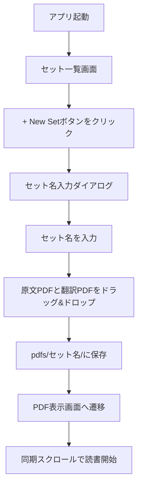
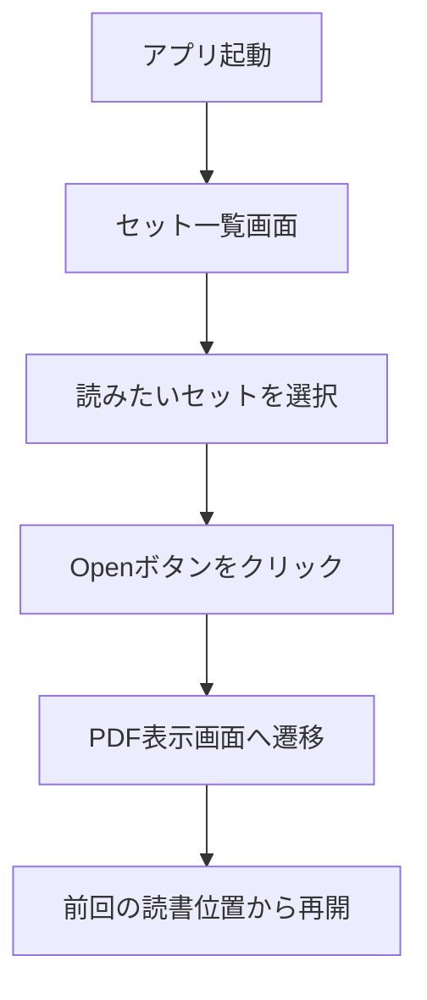

# My PDF Reader - 仕様書

## 📋 プロジェクト概要

**My PDF Reader**は、2つのPDFファイルを左右に並べて同期表示するデスクトップアプリケーションです。主に英語論文の原文と翻訳を並べて読むことを想定しています。

## 🎯 目的

英語論文を読む際、原文と翻訳を交互に見比べる作業を効率化します。従来の「画像翻訳して左右に並べてスクロール」という煩雑な作業を、シンプルなUIで解決します。

## 👥 想定ユーザー

- 英語論文を読む研究者・学生
- 原文と翻訳を比較しながら読みたいユーザー
- 技術文書を精読する必要がある開発者

## 🎯 ユースケース

### 主要ユースケース1：新しい論文セットの登録

1. ユーザーは英語のPDFを入手する
2. 10ページずつ分割してGoogle翻訳で翻訳する
3. 翻訳したPDFを結合する
4. **My PDF Reader**を起動する
5. 「新しいセットを追加」ボタンをクリック
6. セット名を入力（例：「論文-GPT-4-2024」）
7. 原文PDFと翻訳PDFをドラッグ&ドロップ
8. セットがpdfs/フォルダに保存される
9. 左右に並べて同期スクロールで読み進める

### 主要ユースケース2：保存済みセットを開く

1. **My PDF Reader**を起動する
2. セット一覧から読みたいセットを選択（例：「論文-GPT-4-2024」）
3. 前回の読書位置から再開（しおり機能）
4. 左右に並べて同期スクロールで読み進める

## 📦 機能要件

### 必須機能（MVP）

#### 1. PDFセット管理

- **FR-001**: 新しいセットを名前をつけて保存できること
- **FR-002**: セット一覧を表示できること
- **FR-003**: セット一覧から選択して開けること
- **FR-004**: セットを削除できること
- **FR-005**: セットの名前を変更できること

#### 2. PDFファイルの読み込み

- **FR-006**: 2つのPDFファイルをドラッグ&ドロップで読み込めること
- **FR-007**: 左側を「原文」、右側を「翻訳」として表示すること
- **FR-008**: PDFファイルの選択を間違えた場合、再度ドラッグ&ドロップで差し替えできること

#### 3. PDFの表示

- **FR-009**: 左右分割レイアウトで2つのPDFを同時表示すること
- **FR-010**: 各PDFのページを画像またはcanvasでレンダリングすること
- **FR-011**: 拡大/縮小機能を提供すること（最小50%、最大200%）

#### 4. 同期スクロール

- **FR-012**: 左右のPDFスクロール位置を同期させること
- **FR-013**: 片側をスクロールすると、もう片側も同じ比率でスクロールすること
- **FR-014**: 同期スクロールのON/OFFを切り替えできること

#### 5. ナビゲーション

- **FR-015**: ページ番号を表示すること（例：3/120）
- **FR-016**: 前ページ/次ページボタンを提供すること
- **FR-017**: ページ番号入力でジャンプできること

### 追加機能（将来実装）

- **FR-101**: しおり機能（各セットの読書位置を自動保存）
- **FR-102**: 最近開いたセットの履歴表示
- **FR-103**: フルスクリーンモード
- **FR-104**: ダークモード対応
- **FR-105**: セットのエクスポート/インポート機能

## 🔧 非機能要件

### パフォーマンス

- **NFR-001**: 100ページのPDFを5秒以内に読み込めること
- **NFR-002**: スクロール時の遅延が100ms以下であること
- **NFR-003**: メモリ使用量が500MB以下であること（100ページPDF×2の場合）

### ユーザビリティ

- **NFR-004**: 初回起動時、使い方を直感的に理解できること
- **NFR-005**: キーボードショートカットでの操作に対応すること
  - `Space`: 次ページ
  - `Shift+Space`: 前ページ
  - `+/-`: 拡大/縮小
  - `Cmd+O`: ファイルを開く

### 互換性

- **NFR-006**: macOS 12以降で動作すること
- **NFR-007**: Windows 10以降で動作すること（優先度: 中）
- **NFR-008**: Linux（Ubuntu 22.04以降）で動作すること（優先度: 低）

### セキュリティ

- **NFR-009**: ローカルファイルのみ扱い、外部通信を行わないこと
- **NFR-010**: ファイルシステムへの書き込みはpdfs/ディレクトリと設定ファイルのみに制限すること

## 🚫 制約事項

### 技術的制約

1. **PDFのみサポート**
   - 他のフォーマット（EPUB、MOBIなど）は対象外
2. **同一ページ数のPDF前提**
   - 原文と翻訳のページ数が異なる場合の動作は保証しない
3. **テキスト編集不可**
   - 表示のみで、PDF内のテキスト編集機能は提供しない

### ビジネス制約

1. **個人用ツール**
   - 配布・商用利用は想定しない
   - 著作権上、利用は作者のみに制限
2. **オフライン動作**
   - インターネット接続不要
3. **PDF保存場所**
   - すべてのPDFは`pdfs/`ディレクトリに保存される
   - `pdfs/`ディレクトリは`.gitignore`に含まれる（Git管理外）
   - Google DriveなどのクラウドストレージでPDFを同期することを想定

## 📐 UI/UXワイヤーフレーム

### スタート画面（セット選択）

```
┌─────────────────────────────────────────────────┐
│  My PDF Reader                    [+ New Set]  │
├─────────────────────────────────────────────────┤
│                                                 │
│  📚 My PDF Sets                                │
│                                                 │
│  ┌─────────────────────────────────┐           │
│  │ 論文-GPT-4-2024        [Open]   │           │
│  └─────────────────────────────────┘           │
│                                                 │
│  ┌─────────────────────────────────┐           │
│  │ 機械学習の基礎-Chapter3 [Open]  │           │
│  └─────────────────────────────────┘           │
│                                                 │
│  ┌─────────────────────────────────┐           │
│  │ Transformer論文         [Open]  │           │
│  └─────────────────────────────────┘           │
│                                                 │
└─────────────────────────────────────────────────┘
```

### PDF表示画面

```
┌─────────────────────────────────────────────────┐
│  [<- Back] 論文-GPT-4-2024                     │
├─────────────────────────────────────────────────┤
│  [←] [→] Page: [3  ] / 120  Zoom: [100% ▼]   │
├──────────────────┬──────────────────────────────┤
│                  │                              │
│   Original PDF   │   Translated PDF             │
│                  │                              │
│   (Page 3)       │   (Page 3)                   │
│                  │                              │
│   [Scrollable]   │   [Scrollable - Synced]      │
│                  │                              │
│                  │                              │
└──────────────────┴──────────────────────────────┘
```

## 🔄 ユーザーワークフロー

### 新しいセットを追加する



### 保存済みセットを開く



### 通常の読書フロー

1. セット一覧から選択してPDFを開く
2. 前回の読書位置から自動で再開
3. マウスホイールまたはスクロールバーでスクロール
4. 左右が同期してスクロール
5. 必要に応じて拡大/縮小
6. ページジャンプで目的のページへ移動
7. 「← Back」ボタンでセット一覧に戻る

## 📊 成功指標

### MVP完成の定義

以下の機能がすべて動作すること：

- ✅ セットを名前をつけて保存できる
- ✅ セット一覧を表示できる
- ✅ セットを選択して開ける
- ✅ 2つのPDFファイルをドラッグ&ドロップで読み込める
- ✅ 左右分割で表示される
- ✅ 同期スクロールが機能する
- ✅ ページナビゲーションが機能する
- ✅ 拡大/縮小が機能する

### 品質基準

- ✅ 単体テストカバレッジ ≥ 70%
- ✅ E2Eテストで主要フローが検証されている
- ✅ メモリリークがないこと

## 🛣️ ロードマップ

### Phase 1: MVP（v0.1.0）

- 基本的なPDF表示
- 同期スクロール
- ページナビゲーション

### Phase 2: 使いやすさ向上（v0.2.0）

- しおり機能
- 最近開いたファイル
- キーボードショートカット拡充

### Phase 3: 拡張機能（v0.3.0）

- フルスクリーンモード
- ダークモード
- マルチウィンドウ対応

## 📚 参考資料

- [PDF.js](https://mozilla.github.io/pdf.js/) - PDFレンダリングライブラリ
- [Electron](https://www.electronjs.org/) - デスクトップアプリフレームワーク
- [Tauri](https://tauri.app/) - 軽量デスクトップアプリフレームワーク

## 🔄 更新履歴

| バージョン | 日付 | 変更内容 |
|----------|------|---------|
| 1.0.0    | 2026-01-04 | 初版作成 |
